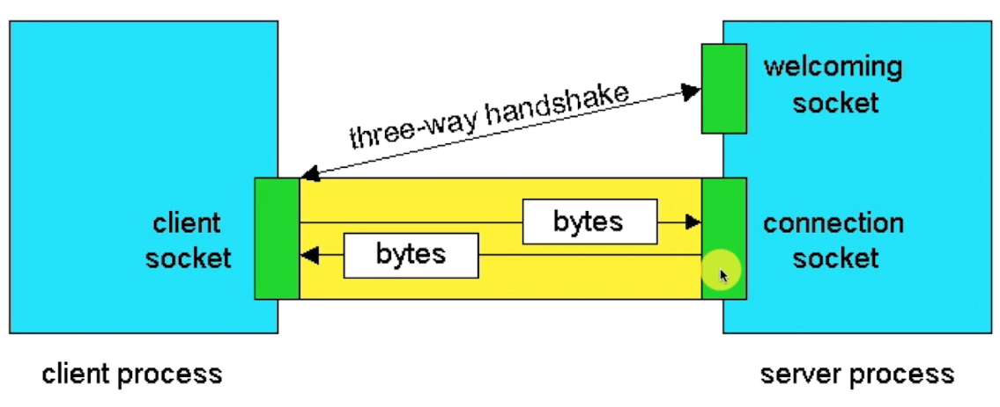

# 一、TCP定义

- Transmission Control Protocol，缩写为TCP
- TCP是**传输控制协议**；是一种**面向连接**的、**可靠的**、**基于字节流**的传输层通信协议，有IETF的RFC793定义
- 与UDP一样完成第四层传输层所指定的功能与职责
- TCP的机制
  - 三次握手、四次挥手
  - 具有校验机制、可靠、数据传输稳定

# 二、TCP链接、传输流程

 

# 三、TCP能做什么

- 聊天消息传送、推送
- 单人语音、视频聊天等
- 几乎UDP能做的都能做，但需要考虑复杂性、性能问题
- 限制：无法进行广播、多播等操作

# 四、TCP核心API

`Socket()`创建新的链接

`bind(Socket bindpoint) throws IOException`

`accept()`接收新的连接

`write()`把数据写入到Socket输出流

`read()`从Socket输入流中读取

