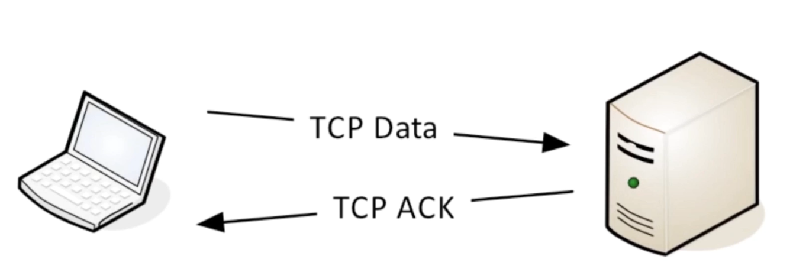
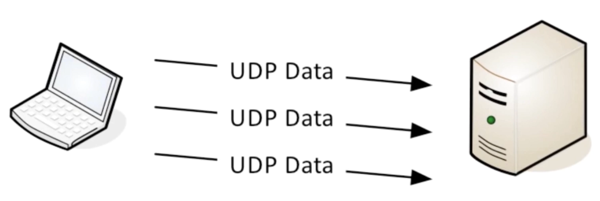
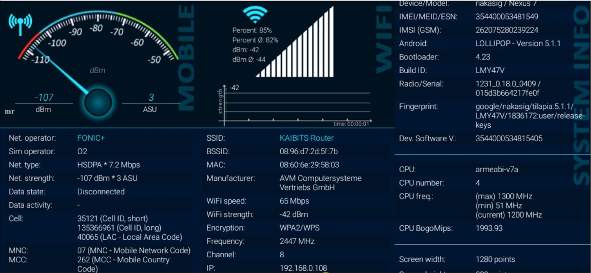

# 一、什么是网络编程

- 什么是网络
  - 在计算机领域中，网络是信息**传输、接收、共享**的虚拟平台
  - 通过它可以把各个点、面、体的信息联系到一起，从而实现这些资源的**共享**
  - 网络是人类发展史来最重要的发明，提高了科技和人类社会的发展

- 什么是网络编程
  - 网络编程从大的方面说就是对信息的发送到接收
  - 通过操作相应的API调度计算机硬件资源，并利用传输管道（网线）进行数据交换的过程
  - 更为具体的涉及：网络模型、套接字、数据包

- 7层网络模型-OSI
  - 基础层：物理层（Physical）、数据链路层（Datalink）、网络层（Network）
  - 传输层（Transport）：TCP-UDP协议层、Socket
  - 高级层：会话层（Session）、表示层（Presentation）、应用层（Application）


# 二、Socket与TCP、UDP

## （一）Socket

- 什么是Socket
  - 简单来说是IP地址与端口的结合协议（RFC793）
  - 一种地址与端口的结合描述协议
  - TCP/IP协议的相关API的总称；是网络API的集合实现
  - 涵盖了：Stream Socket/Datagram Socket
- Socket的作用与组成
  - 在网络传输中用于唯一标识两个端点之间的链接
  - 端点：包括IP和Port
  - 4个要素：
    - 客户端地址、客户端端口
    - 服务器地址、服务器端口
- Socket传输原理：IP Address + Port number = Socket

## （二）TCP、UDP

- Socket之TCP
  - TCP是面向连接的通信协议
  - 通过三次握手建立连接，通讯完成时要拆除连接
  - 由于TCP是面向连接的，所以只能用于端到端的通讯
- Socket之UDP
  - UDP是面向无连接的通讯协议
  - UDP数据包括目的端口号和源端口号信息
  - 由于通讯不需要连接，所以可以实现广播发送，并不局限于端到端
- TCP传输示意
  - 只有传输端接收到接收端的回应时才能传输成功
  - 图解
- UDP传输示意
  - 不需要接收到接收端的回应
  - 图解

## （三）Client-Server Application

- TCP/IP协议中，两个进程间通信的主要模式：**CS模型**
- 主要目的：协同网络中的计算机资源、服务模式、进程间数据共享
- 常见的：FTP（文件传输协议）、SMTP（邮件传输协议）、HTTP（超文本传输协议）

# 三、实战：客户端/服务端的实现

- 主要目标
  - 构建TCP客户端、服务端
  - 客户端发送数据
  - 服务器读取数据并打印

代码实现：

客户端代码：

```java
import java.io.*;
import java.net.*;

/**
 * @author zhinushannan
 * @date 2021/3/5
 * @description
 */
public class Client {

    public static void main(String[] args) throws IOException {
        Socket socket = new Socket();
        // 设置超时时间
        socket.setSoTimeout(3000);
        // 连接本地，端口2000；超时时间3000
        socket.connect(new InetSocketAddress(Inet4Address.getLocalHost(), 2000), 3000);

        System.out.println("已发起服务器连接，并进入后续流程~");
        System.out.println("客户端信息：" + socket.getLocalAddress() + " P：" + socket.getLocalPort());
        System.out.println("服务器信息：" + socket.getInetAddress() + "P：" + socket.getPort());

        try {
            // 发送接收数据
            todo(socket);
        } catch (IOException e) {
            System.out.println("异常关闭");
        }

        // 释放资源
        socket.close();
        System.out.println("客户端已退出");

    }

    private static void todo(Socket client) throws IOException {
        // 构建数据输入流
        InputStream in = System.in;
        BufferedReader input = new BufferedReader(new InputStreamReader(in));

        // 得到Socket输出流，并转换为打印流
        OutputStream outputStream = client.getOutputStream();
        PrintStream socketPrintStream = new PrintStream(outputStream);

        // 得到Socket输入流，并转换为BufferedReader
        InputStream inputStream = client.getInputStream();
        BufferedReader socketBufferedReader = new BufferedReader(new InputStreamReader(inputStream));

        boolean flag = true;
        do {
            // 键盘读取一行并打印
            String str = input.readLine();
            socketPrintStream.println(str);

            // 从服务器读取一行
            String echo = socketBufferedReader.readLine();
            String closeValue = "bye";
            if (closeValue.equalsIgnoreCase(echo)) {
                flag = false;
            } else {
                System.out.println(echo);
            }
        } while (flag);

        // 资源释放
        socketPrintStream.close();
        socketBufferedReader.close();

    }

}
```

服务端代码：

```java
import java.io.BufferedReader;
import java.io.IOException;
import java.io.InputStreamReader;
import java.io.PrintStream;
import java.net.ServerSocket;
import java.net.Socket;

/**
 * @author zhinushannan
 * @date 2021/3/5
 * @description
 */
public class Server {

    public static void main(String[] args) throws IOException {
        ServerSocket server = new ServerSocket(2000);

        System.out.println("服务器准备就绪");
        System.out.println("服务器信息：" + server.getInetAddress() + " P：" + server.getLocalPort());

        // 等待客户端连接
        for (;;) {
            // 得到客户端
            Socket client = server.accept();
            // 客户端构建异步线程
            ClientHandler clientHandler = new ClientHandler(client);
            // 启动线程
            clientHandler.start();
        }
    }

    /**
     * 客户端消息处理
     */
    private static class ClientHandler extends Thread {
        private Socket socket;

        private boolean flag = true;

        ClientHandler(Socket socket) {
            this.socket = socket;
        }

        @Override
        public void run() {
            System.out.println("新客户端连接了：" + socket.getInetAddress() + " P：" + socket.getPort());
            try {
                // 得到打印流，用于数据输出；服务器回送数据使用
                PrintStream socketOutput = new PrintStream(socket.getOutputStream());
                // 而得到输入流，用于接收数据
                BufferedReader socketInput = new BufferedReader(new InputStreamReader(socket.getInputStream()));

                String closeValue = "bye";
                do {
                    String str = socketInput.readLine();
                    if (closeValue.equalsIgnoreCase(str)) {
                        this.flag = false;
                        // 回送
                        socketOutput.println("bye");
                    } else {
                        // 打印到屏幕，并回送数据长度
                        System.out.println(str);
                        socketOutput.println("回送：" + str.length());
                    }
                } while (flag);
                socketInput.close();
                socketOutput.close();
            } catch (IOException e) {
                System.out.println("连接异常断开");
            } finally {
                // 连接关闭
                try {
                    socket.close();
                } catch (IOException e) {
                    e.printStackTrace();
                }
            }

            System.out.println("客户端已关闭：" + socket.getInetAddress() + " P：" + socket.getPort());

        }
    }

}
```

# 四、报文、协议、Mac地址、IP、端口、远程服务器

- 报文段：

  - 报文段是指TCP/IP协议网络传输过程中，起着路由导航作用
  - 用以查询各个网络路由网段、IP地址、交换协议等IP数据包
  - 报文段充当整个TCP/IP协议数据包的导航路由功能
  - 报文在传输过程中回不断地封装成分组、包、帧来传输
  - 封装方式就是添加一些控制信息组成的首部，即报文头

- 传输协议：

  - 协议顾名思义，就是一种规定、一种约定
  - 约定大于配置，在网络传输中依然适用；网络的传输流程是健壮的、稳定的，得益于基础的协议构成
  - 简单来说：A->B的传输数据，B能识别，反之B->A的传输数据A也能识别，这就是协议

- Mac地址：

  - Media Access Control或者Medium Access Control
  - 意译为媒体访问控制，或称为物理地址、硬件地址
  - 用来定义**网络设备**的**位置**
  - 形如：44-45-53-54-00-00；与身份证类似

  

- IP地址

  - 互联网协议地址（Internet Protocol Address，又译为网际协议地址），缩写为IP地址（英语：IP Address）
  - 是分配给网络上使用网际协议（Internet Protocol， IP）的设备的数字标签
  - 常见的IP地址分为IPv4和IPv6两大类
  - IPv4
    - IPv4地址由32位二进制数组成，常以XXX.XXX.XXX.XXX形式表现，每组XXX代表小于或等于255的10进制数（如：208.80.152.2）
    - 分为A、B、C、D、E五大类、其中E类属于特殊保留地址
    - 总数量：4,294,967,296个（即2<sup>32</sup>）：42亿个；最终于2011年2月3日用尽
    - IP地址1.1.1.1，那么这个地址为直接广播地址
    - IP地址255.255.255.255为受限广播地址
  - IPv6
    - IPv6地址是由128位二进制数组成的，一般采用32个十六进制数
    - 由两个逻辑部分组成：一个64位的网络前缀和一个64位的主机地址，主机地址通常根据物理地址自动生成，叫做EUI-64（或者64位扩展唯一标识）
    - 例：`2001:0db8:85a3:0000:1319:8a2e:0370:7344`
    - IPv4转换为IPv6一定可行，但IPv6转换为IPv4不一定可行

- 端口

  - 如果把IP地址比作一间房子，端口就是出入这间房子的门或者窗户
  - 在不同门、窗户后有不同的人，房子中的用户与外界交流的出口
  - 外界的鸽子（信息）飞到不同窗户也就是给不同的人传递信息
  - 0-1023号端口以及1024-49151号端口都是特殊端口
  - 计算机之间依照互联网传输层TCP/IP协议的协议通信，不同的协议都对应不用的端口
  - 49152到65535号端口属于“动态端口”范围，没有端口可以被正式地注册占用

| Service, Protocol, or Application   | Port Number | TCP or UDP |
| ----------------------------------- | ----------- | ---------- |
| FTP(File Transfer Protocol)         | 20, 21      | TCP        |
| SSH(Secure Shell Protocol)          | 22          | TCP        |
| Tenet                               | 23          | TCP        |
| SMTP(Simple Mail Transfer Protocol) | 25          | TCP        |
| DNS(Domain Name System)             | 53          | UDP        |
| TFTP                                | 69          | UDP        |
| HTTP                                | 80          | TCP        |
| POP3                                | 110         | TCP        |
| IMAP4                               | 143         | TCP        |
| HTTPS                               | 443         | TCP        |

- 远程服务器
  - 局域网：一般而言，家庭网络环境、公司网络环境等都属于局域网
  - 不同公司之间的网络属于互联网
  - 默认的：不在同一局域网下的两台电脑是无法直接建立链接的
    - 不在同一局域网下的两台电脑通信原理：A将数据发送到服务器，服务器将数据发送到B


