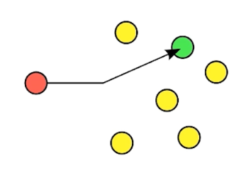
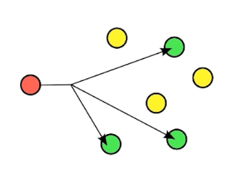
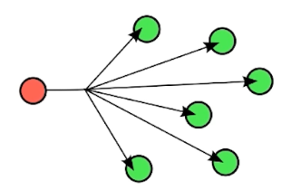

# 一、什么是UDP

- 什么是UDP
  - UDP：User Datagram Protocol
  - 一种**用户数据报协议**，又称**用户数据报文协议**
  - 是一个简单的面向**数据报**的**传输层**协议，正式规范为RFC 768
  - 是一种用户数据协议，不是连接协议

- 为什么说UDP不可靠
  - 它一旦把应用程序发给网络层的数据发送出去，就不保留数据备份
  - UDP在IP数据报的头部仅仅加入了复用和数据校验（字段）
  - 发送端生产数据，接收端从网络中抓取数据
  - 特点：结构简单、无校验、速度快、容易丢包、可广播
- UDP能做什么
  - DNS、TFTP、SNMP
  - 视频、音频、普通数据（无关紧要数据）
  - UDP的结构：
    - UDP总共长64位
    - 第一段：0-15存放发送端的端口号（`Source Port`），16-31存放接收端的端口号（`Destination Port`）
    - 第二段：0-15存放字节长度（`Length`），16-31存放头部和数据的校验字段（`Header and Data Checksum`）
- UDP包的最大长度
  - 头部使用两个字节用来记录包体长度（`Length`） ==> 216-1 = 64K - 1 = 65536 - 1 = 65535
  - 20个字节用于记录IP包头 ==> 65535 - 20 = 65515
  - 自身协议占用：32+32位 = 64位 = 8字节 => 65515 - 8 = 65507

# 二、UDP核心API

- `java.net.DatagramSocket`
- `java.net.DatagramPacket`

# 三、UDP单播、广播、多播

- 单播：点对点的发送
  - 
- 多播：对一组计算机进行发送
  - 
- 广播
  - 
- IP地址分类
  - A类
    - 地址范围：1.0.0.0 - 126.255.255.255
    - 网络号范围：1-126
    - 默认子网掩码：255.0.0.0
    - 作用：一般用于大型网络
  - B类
    - 地址范围：128.0.0.0 - 191.255.255.255
    - 默认子网掩码：255.255.0.0
  - C类
    - 地址范围：192.0.0.0 - 223.255.255.255
    - 默认子网掩码：255.255.255.0.
  - D类
    - 地址范围：224.0.0.0 - 239.255.255.255
    - 用于多播的地址，无子网掩码
  - E类
    - 地址范围：240.0.0.0 - 255.255.255.255
    - 其中240.0.0.0 - 255.255.255.254 作为保留地址，用于Internet试验和研发255.255.255.255是广播地址

